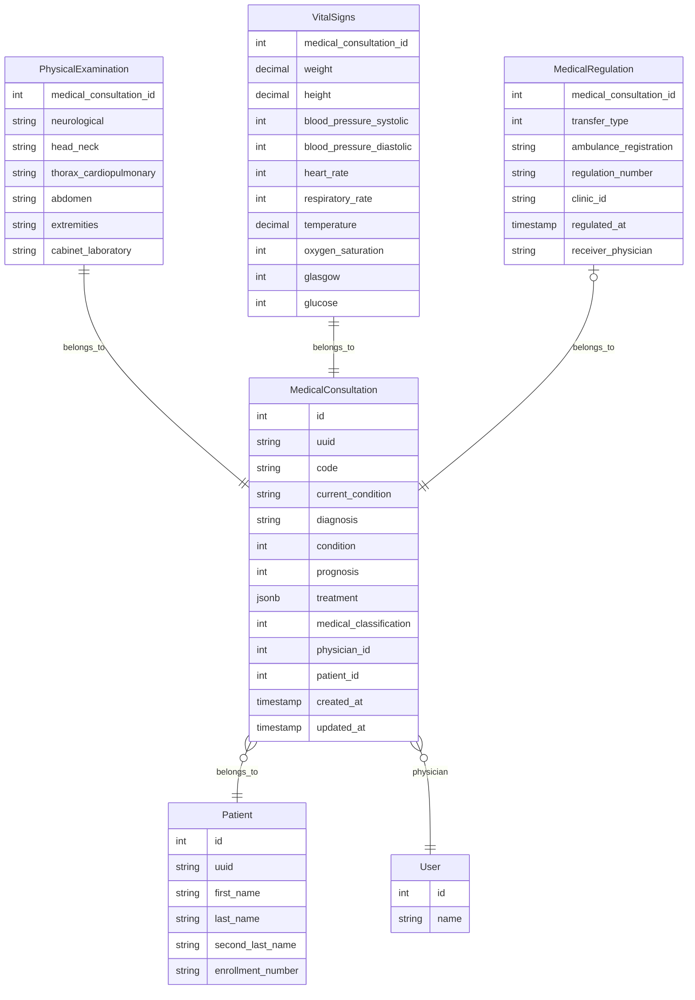

# Consultas médicas

Este documento describe el módulo de consultas médicas implementado en la etapa 04: las cuatro tablas que almacenan una
consulta, sus enums y su código generado, las reglas de validación y autorización, la búsqueda de pacientes basada en
Scout del dashboard del personal y las páginas que componen el flujo de consulta.

En resumen:

- Solo el personal autenticado usa este módulo. Todas las rutas están detrás del middleware `auth` más una comprobación
  `can:`; no existe ninguna superficie de consultas pública ni orientada a pacientes.
- Una consulta es un único agregado: una fila de `medical_consultations` más exactamente una fila de signos vitales,
  exactamente una fila de exploración física y una fila opcional de regulación médica (traslado). El agregado siempre se
  escribe en una sola transacción.
- El usuario autenticado que crea una consulta se convierte en su médico. Solo ese médico (con el permiso
  correspondiente) puede editarla o eliminarla; `super-admin` omite esta restricción mediante `Gate::before()` (ver
  [ADR-0005](../adr/0005-permission-taxonomy-and-role-catalog.md)).
- Los pacientes se localizan mediante Laravel Scout + Meilisearch (ver
  [ADR-0006](../adr/0006-busqueda-de-pacientes-con-scout-y-meilisearch.md)).

Convenciones usadas en todo este documento:

- Los timestamps son `TIMESTAMP WITH TIME ZONE` y la zona horaria de la aplicación es `UTC` (`config/app.php`).
- Todas las columnas enteras con códigos de dominio están respaldadas por un backed enum de PHP (tipo de respaldo
  `int`); la base de datos impone el mismo dominio de valores de forma independiente mediante una restricción `CHECK`
  con nombre.
- Las tres tablas hijas usan `medical_consultation_id` como clave primaria, lo que hace que cada una tenga una relación
  uno a uno con la consulta, y su clave foránea se elimina en cascada.

## MedicalConsultation

Nombre de la tabla: `medical_consultations`

| columna                | tipo                     | restricciones                                             | descripción                                                                                            |
|------------------------|--------------------------|-----------------------------------------------------------|--------------------------------------------------------------------------------------------------------|
| id                     | SERIAL                   | PK                                                        | Clave primaria sustituta de la consulta.                                                               |
| uuid                   | UUID                     | NOT NULL, UNIQUE                                          | Identificador público (UUID v7, generado en el hook `creating` del modelo); se usa como clave de ruta. |
| code                   | VARCHAR(14)              | NOT NULL, UNIQUE, CHECK (code ~ '^MC-[0-9]{6}-[0-9]{4}$') | Código secuencial diario legible (ver [Código de consulta](#código-de-consulta)).                      |
| current_condition      | VARCHAR(1024)            | NOT NULL                                                  | Padecimiento actual / motivo de la visita ("Padecimiento actual").                                     |
| diagnosis              | VARCHAR(1024)            | NOT NULL                                                  | Diagnóstico.                                                                                           |
| condition              | SMALLINT                 | NOT NULL, CHECK (condition BETWEEN 1 AND 5)               | Estado del paciente (enum PHP `MedicalState`).                                                         |
| prognosis              | SMALLINT                 | NOT NULL, CHECK (prognosis BETWEEN 1 AND 5)               | Pronóstico (enum PHP `MedicalState`).                                                                  |
| treatment              | JSONB                    | NOT NULL, CHECK (jsonb_typeof(treatment) = 'array')       | Filas del tratamiento prescrito (ver más abajo).                                                       |
| medical_classification | SMALLINT                 | NOT NULL, CHECK (medical_classification BETWEEN 1 AND 10) | Área clínica (enum PHP `MedicalClassification`).                                                       |
| physician_id           | INTEGER                  | NOT NULL, FK users(id)                                    | Usuario que creó la consulta; nunca cambia.                                                            |
| patient_id             | INTEGER                  | NOT NULL, FK patients(id)                                 | Paciente al que pertenece la consulta; nunca cambia.                                                   |
| created_at             | TIMESTAMP WITH TIME ZONE | NULLABLE                                                  | Fecha y hora de creación de la consulta.                                                               |
| updated_at             | TIMESTAMP WITH TIME ZONE | NULLABLE                                                  | Fecha y hora de la última actualización.                                                               |

- El índice compuesto sobre (physician_id, created_at) respalda la lista "mis últimas consultas" del dashboard.
- El índice compuesto sobre (patient_id, created_at) respalda la lista "últimas consultas" del resumen del paciente.
- Las claves foráneas `physician_id` y `patient_id` **no** se eliminan en cascada: un usuario o un paciente con
  consultas no puede eliminarse a nivel de base de datos.
- `treatment` es un arreglo JSON de objetos con exactamente esta forma. El arreglo puede estar vacío y contiene como
  máximo 20 filas; cada clave es una cadena obligatoria de como máximo 255 caracteres:

  ```json
  [{ "medication": "Paracetamol", "dose": "500 mg", "frequency": "Every 8 hours", "duration": "5 days" }]
  ```

## PhysicalExamination

Nombre de la tabla: `physical_examinations`

| columna                 | tipo         | restricciones                                      | descripción                                   |
|-------------------------|--------------|----------------------------------------------------|-----------------------------------------------|
| medical_consultation_id | INTEGER      | PK, FK medical_consultations(id) ON DELETE CASCADE | Consulta a la que pertenece esta exploración. |
| neurological            | VARCHAR(512) | NOT NULL                                           | Hallazgos neurológicos.                       |
| head_neck               | VARCHAR(512) | NOT NULL                                           | Hallazgos de cabeza y cuello.                 |
| thorax_cardiopulmonary  | VARCHAR(512) | NOT NULL                                           | Hallazgos de tórax y cardiopulmonares.        |
| abdomen                 | VARCHAR(512) | NOT NULL                                           | Hallazgos abdominales.                        |
| extremities             | VARCHAR(512) | NOT NULL                                           | Hallazgos en extremidades.                    |
| cabinet_laboratory      | VARCHAR(512) | NOT NULL                                           | Resultados de gabinete y laboratorio.         |

## VitalSigns

Nombre de la tabla: `vital_signs`

| columna                  | tipo         | restricciones                                         | descripción                                         |
|--------------------------|--------------|-------------------------------------------------------|-----------------------------------------------------|
| medical_consultation_id  | INTEGER      | PK, FK medical_consultations(id) ON DELETE CASCADE    | Consulta a la que pertenecen estos signos vitales.  |
| weight                   | DECIMAL(5,2) | NOT NULL                                              | Peso en kilogramos (kg).                            |
| height                   | DECIMAL(3,2) | NOT NULL                                              | Estatura en **metros** (m), por ejemplo `1.72`.     |
| blood_pressure_systolic  | SMALLINT     | NOT NULL                                              | Presión arterial sistólica (mmHg).                  |
| blood_pressure_diastolic | SMALLINT     | NOT NULL                                              | Presión arterial diastólica (mmHg).                 |
| heart_rate               | SMALLINT     | NOT NULL                                              | Frecuencia cardiaca (latidos por minuto).           |
| respiratory_rate         | SMALLINT     | NOT NULL                                              | Frecuencia respiratoria (respiraciones por minuto). |
| temperature              | DECIMAL(3,1) | NOT NULL                                              | Temperatura corporal (°C).                          |
| oxygen_saturation        | SMALLINT     | NOT NULL, CHECK (oxygen_saturation BETWEEN 0 AND 100) | Saturación de oxígeno, SpO2 (%).                    |
| glasgow                  | SMALLINT     | NOT NULL, CHECK (glasgow BETWEEN 3 AND 15)            | Puntuación en la escala de coma de Glasgow.         |
| glucose                  | SMALLINT     | NULLABLE                                              | Glucosa capilar (mg/dL); opcional.                  |

- El modelo `VitalSigns` convierte `weight` y `height` a `decimal:2` y `temperature` a `decimal:1`, por lo que llegan al
  frontend como cadenas con precisión fija.

## MedicalRegulation

Nombre de la tabla: `medical_regulations`

Una regulación registra que el paciente fue trasladado ("regulado") a otra unidad. Es opcional: la mayoría de las
consultas no tiene una fila aquí.

| columna                 | tipo                     | restricciones                                      | descripción                                                     |
|-------------------------|--------------------------|----------------------------------------------------|-----------------------------------------------------------------|
| medical_consultation_id | INTEGER                  | PK, FK medical_consultations(id) ON DELETE CASCADE | Consulta a la que pertenece esta regulación.                    |
| transfer_type           | SMALLINT                 | NOT NULL, CHECK (transfer_type BETWEEN 1 AND 3)    | Forma en que se traslada al paciente (enum PHP `TransferType`). |
| ambulance_registration  | VARCHAR(255)             | NULLABLE                                           | Número de registro de la ambulancia.                            |
| regulation_number       | VARCHAR(255)             | NULLABLE                                           | Número de regulación (referencia).                              |
| clinic_id               | VARCHAR(255)             | NULLABLE                                           | Identificador de la clínica receptora.                          |
| regulated_at            | TIMESTAMP WITH TIME ZONE | NOT NULL                                           | Fecha y hora de la regulación.                                  |
| receiver_physician      | VARCHAR(255)             | NULLABLE                                           | Nombre del médico receptor.                                     |

## Enums

El backend solo envía valores enteros crudos; las etiquetas en español de la UI viven en
`resources/js/lib/consultationLabels.ts`.

- Enum PHP `MedicalState`, usado tanto por `condition` como por `prognosis`:
    - 1: Good — "Bueno"
    - 2: Fair — "Regular"
    - 3: Serious — "Grave"
    - 4: Critical — "Crítico"
    - 5: Guarded — "Reservado"

- Enum PHP `MedicalClassification`, valores de `medical_classification`:
    - 1: Trauma — "Traumatología"
    - 2: Otolaryngology — "Otorrinolaringología"
    - 3: Respiratory — "Respiratorio"
    - 4: Gastroenterology — "Gastroenterología"
    - 5: Ophthalmology — "Oftalmología"
    - 6: Cardiology — "Cardiología"
    - 7: Dermatology — "Dermatología"
    - 8: Neurology — "Neurología"
    - 9: Endocrinology — "Endocrinología"
    - 10: Psychiatry — "Psiquiatría"

- Enum PHP `TransferType`, valores de `transfer_type`:
    - 1: Institute — "Instituto"
    - 2: MunicipalHealthServices — "Servicios de Salud Municipales"
    - 3: OwnResources — "Medios propios"

## Restricciones únicas e índices con nombre

| Tabla                 | Nombre de la restricción                              | Columnas                              |
|-----------------------|-------------------------------------------------------|---------------------------------------|
| medical_consultations | medical_consultations_uuid_unique                     | UNIQUE (uuid)                         |
| medical_consultations | medical_consultations_code_unique                     | UNIQUE (code)                         |
| medical_consultations | medical_consultations_physician_id_created_at_index   | INDEX (physician_id, created_at)      |
| medical_consultations | medical_consultations_patient_id_created_at_index     | INDEX (patient_id, created_at)        |
| medical_consultations | medical_consultations_physician_id_foreign            | FK (physician_id) → users(id)         |
| medical_consultations | medical_consultations_patient_id_foreign              | FK (patient_id) → patients(id)        |
| physical_examinations | physical_examinations_medical_consultation_id_foreign | FK (medical_consultation_id), CASCADE |
| vital_signs           | vital_signs_medical_consultation_id_foreign           | FK (medical_consultation_id), CASCADE |
| medical_regulations   | medical_regulations_medical_consultation_id_foreign   | FK (medical_consultation_id), CASCADE |

## Restricciones CHECK con nombre

| Tabla                 | Nombre de la restricción          | Regla                                     |
|-----------------------|-----------------------------------|-------------------------------------------|
| medical_consultations | chk_code_format                   | `code ~ '^MC-[0-9]{6}-[0-9]{4}$'`         |
| medical_consultations | chk_condition_domain              | `condition BETWEEN 1 AND 5`               |
| medical_consultations | chk_prognosis_domain              | `prognosis BETWEEN 1 AND 5`               |
| medical_consultations | chk_medical_classification_domain | `medical_classification BETWEEN 1 AND 10` |
| medical_consultations | chk_treatment_is_array            | `jsonb_typeof(treatment) = 'array'`       |
| vital_signs           | chk_glasgow_domain                | `glasgow BETWEEN 3 AND 15`                |
| vital_signs           | chk_oxygen_saturation_domain      | `oxygen_saturation BETWEEN 0 AND 100`     |
| medical_regulations   | chk_transfer_type_domain          | `transfer_type BETWEEN 1 AND 3`           |

## Código de consulta

Cada consulta recibe un código como `MC-260923-0007`, generado por `App\Support\MedicalConsultationCode::next()` desde
el hook `creating` del modelo. Los clientes nunca lo envían y nunca cambia.

| Aspecto      | Regla                                                                                                                                                                                                                                                           |
|--------------|-----------------------------------------------------------------------------------------------------------------------------------------------------------------------------------------------------------------------------------------------------------------|
| Formato      | `MC-YYMMDD-NNNN`, siempre de 14 caracteres; lo impone `chk_code_format` y `code` es `UNIQUE`.                                                                                                                                                                   |
| Secuencia    | `NNNN` se reinicia en `0001` cada día y se incrementa de uno en uno (siguiente = código más alto existente del día + 1).                                                                                                                                        |
| Día          | `YYMMDD` es el día calendario actual en `America/Mexico_City`, mientras que `created_at` se almacena en UTC. Por lo tanto, una consulta creada a las 23:30 hora local lleva ese día local en su código aunque su timestamp UTC ya corresponda al día siguiente. |
| Concurrencia | Toma `pg_advisory_xact_lock(hashtext('medical_consultations.code'), YYMMDD)`, de modo que las creaciones concurrentes del mismo día se serializan en lugar de competir por el mismo número. El lock se libera al hacer commit o rollback.                       |
| Transacción  | Debe ejecutarse dentro de una transacción abierta; fuera de una lanza una `LogicException`. `MedicalConsultationController::store()` envuelve todo el agregado en `DB::transaction()`.                                                                          |
| Límite       | 9999 consultas por día; la número 10,000 lanza una `RuntimeException`.                                                                                                                                                                                          |

## Validación

`StoreMedicalConsultationRequest` y `UpdateMedicalConsultationRequest` validan el mismo agregado. Puntos destacados:

| Regla                          | Detalle                                                                                                                                                                                                   |
|--------------------------------|-----------------------------------------------------------------------------------------------------------------------------------------------------------------------------------------------------------|
| Claves desconocidas rechazadas | Ambos requests llevan `#[FailOnUnknownFields]`; cualquier clave no declarada en `rules()` (en cualquier nivel de anidamiento) hace fallar la validación.                                                  |
| El paciente es inmutable       | Solo el request de creación acepta `patient_uuid` (debe existir en `patients.uuid`). En la actualización es una clave desconocida y se rechaza; `code` y `physician_id` tampoco se aceptan nunca.         |
| Precisión decimal              | `weight` y `height` usan `decimal:0,2`; `temperature` usa `decimal:0,1`, en concordancia con la escala de la columna.                                                                                     |
| Rangos fisiológicos            | peso 0.5–500, estatura 0.30–2.50, sistólica 40–300, diastólica 20–200, frecuencia cardiaca 20–300, frecuencia respiratoria 4–80, temperatura 30–45, SpO2 0–100, Glasgow 3–15, glucosa 10–2000 (nullable). |
| Diastólica < sistólica         | Un callback `after()` rechaza `diastolic >= systolic` en `vital_signs.blood_pressure_diastolic` (solo cuando ambos campos pasaron sus propias reglas).                                                    |
| Tratamiento                    | `present`, array, `max:20`; cada fila requiere `medication`, `dose`, `frequency`, `duration`.                                                                                                             |
| Regulación                     | `regulation` es nullable; cuando está presente, `transfer_type` y `regulated_at` son `required_with:regulation` y el resto son opcionales.                                                                |

El payload anida `current_condition` y `diagnosis` bajo `consultation`, y las entidades hijas bajo `vital_signs`,
`physical_examination` y `regulation`; `condition`, `prognosis`, `medical_classification` y `treatment` están en el
nivel superior. Los mensajes de error y los nombres de atributos provienen de
`lang/es/modules/consultations/management.php`.

En la actualización, enviar `regulation: null` elimina una fila de regulación existente; enviar un objeto la crea o la
reemplaza.

## Autorización

El módulo usa cinco permisos de `App\Enums\Permission`:

| Permiso                | Otorga                                                                            |
|------------------------|-----------------------------------------------------------------------------------|
| `consultations.view`   | Dashboard, detalle de la consulta, endpoint de últimas consultas.                 |
| `consultations.create` | Página de nueva consulta y guardado de una consulta nueva.                        |
| `consultations.update` | Edición de una consulta — **solo las propias**.                                   |
| `consultations.delete` | Eliminación de una consulta — **solo las propias**.                               |
| `patients.view`        | Búsqueda de pacientes y (junto con `consultations.view`) el resumen del paciente. |

- `MedicalConsultationPolicy::update()` y `::delete()` exigen el permiso **y** la propiedad:
  `$consultation->physician_id === $user->id`. Tener solo `consultations.update` no permite a un usuario editar la
  consulta de un colega.
- `super-admin` nunca se trata como caso especial en una Policy. Su acceso irrestricto (incluidas las consultas de otros
  médicos) proviene únicamente del callback `Gate::before()` en `AppServiceProvider` (ver
  [ADR-0005](../adr/0005-permission-taxonomy-and-role-catalog.md)
  y [usuarios, roles y permisos](users-roles-permissions.md)).
- Tanto los controladores como las páginas exponen los flags `can.update` / `can.delete` para que la UI oculte Editar y
  Eliminar en las consultas que el usuario no puede modificar; el middleware `can:` del servidor sigue siendo el límite
  real (HTTP 403 en caso contrario).
- La barra lateral muestra la entrada "Consultas" solo a los usuarios con `consultations.view`.

> **Decisión de producto deliberada:** la tarjeta plegable del perfil del paciente en las páginas de creación, detalle
> y edición muestra el perfil **completo** del paciente (identidad, número de seguridad social, datos de contacto,
> contactos de emergencia, padecimientos, historial ginecológico) a cualquiera que pueda abrir esas páginas. Abrir la
> página de creación solo requiere `consultations.create`, y la página de detalle solo `consultations.view` — ahí no se
> comprueba `patients.view`.

## Indexación para la búsqueda de pacientes

La búsqueda de pacientes sigue [ADR-0006](../adr/0006-busqueda-de-pacientes-con-scout-y-meilisearch.md):

| Tema                  | Comportamiento                                                                                                                                                                           |
|-----------------------|------------------------------------------------------------------------------------------------------------------------------------------------------------------------------------------|
| Motor                 | Laravel Scout con Meilisearch; el servicio `meilisearch` de `docker-compose.dev.yml` está fijado a `getmeili/meilisearch:v1.54.0`.                                                       |
| Campos indexados      | `Patient::toSearchableArray()` envía solo `first_name`, `last_name`, `second_last_name`, `enrollment_number`; `config/scout.php` declara esos mismos cuatro como `searchableAttributes`. |
| Cuándo se indexa      | `after_commit` es `true`, por lo que un registro de paciente revertido (rollback) nunca se indexa.                                                                                       |
| Cómo se indexa        | De forma síncrona (`queue` es `false`); no hay worker de colas.                                                                                                                          |
| Pruebas               | `phpunit.xml` establece `SCOUT_DRIVER=collection`, por lo que la suite no necesita Meilisearch.                                                                                          |
| Configuración inicial | `make setup` ejecuta `php artisan scout:sync-index-settings` y `php artisan scout:import "App\Models\Patient"` después de migrar.                                                        |
| Consulta              | `GET /dashboard/patients/search?query=…` (1–100 caracteres) devuelve como máximo 10 coincidencias.                                                                                       |
| Cliente               | `PatientSearch.vue` busca desde 1 carácter con un debounce de 50 ms y aborta las peticiones en curso.                                                                                    |

**Si Meilisearch no está disponible:** como la indexación es síncrona y posterior al commit, el registro público de
pacientes (`POST /patients/register`) guarda al paciente en Postgres pero luego falla con un error no controlado, de
modo que el usuario ve un error aunque el registro exista. Las peticiones de búsqueda del dashboard también fallan y el
cuadro de búsqueda no muestra resultados. Esta es la consecuencia documentada y aceptada en ADR-0006.

> `config/scout.php` recurre al driver `collection` cuando `SCOUT_DRIVER` no está definido, por lo que un entorno debe
> establecer `SCOUT_DRIVER=meilisearch` de forma explícita para usar Meilisearch.

## Rutas y páginas

Todas las rutas requieren `auth`; la autorización la aplica el middleware `can:` de cada ruta.

| Método | URI                                    | Nombre                           | Autorización                           | Respuesta                                                                                       |
|--------|----------------------------------------|----------------------------------|----------------------------------------|-------------------------------------------------------------------------------------------------|
| GET    | `/dashboard`                           | `dashboard.index`                | `consultations.view`                   | Inertia `dashboard/Index`                                                                       |
| GET    | `/dashboard/patients/search`           | `dashboard.patients.search`      | `patients.view`                        | JSON, hasta 10 pacientes                                                                        |
| GET    | `/dashboard/patients/{patient}`        | `dashboard.patients.summary`     | `patients.view` + `consultations.view` | JSON, datos básicos del paciente + 5 últimas consultas                                          |
| GET    | `/dashboard/consultations`             | `dashboard.consultations.latest` | `consultations.view`                   | JSON, las 10 últimas consultas propias                                                          |
| GET    | `/consultations/create?patient={uuid}` | `consultations.create`           | `consultations.create`                 | Inertia `consultations/Create` (422 ante un UUID mal formado, 404 ante un paciente desconocido) |
| POST   | `/consultations`                       | `consultations.store`            | `consultations.create`                 | Redirect a `dashboard.index` con flash                                                          |
| GET    | `/consultations/{consultation}`        | `consultations.show`             | `consultations.view`                   | Inertia `consultations/Show`                                                                    |
| GET    | `/consultations/{consultation}/edit`   | `consultations.edit`             | `consultations.update` + propiedad     | Inertia `consultations/Edit`                                                                    |
| PUT    | `/consultations/{consultation}`        | `consultations.update`           | `consultations.update` + propiedad     | Redirect a `dashboard.index` con flash                                                          |
| DELETE | `/consultations/{consultation}`        | `consultations.destroy`          | `consultations.delete` + propiedad     | Redirect a `dashboard.index` con flash                                                          |

`{patient}` y `{consultation}` se resuelven por `uuid`, nunca por el id numérico. La eliminación es definitiva (hard
delete); las filas hijas se eliminan mediante la cascada de la base de datos.

### Flujo de la interfaz

1. **Dashboard** (`dashboard/Index.vue`): la barra de búsqueda de pacientes (visible solo con `patients.view`) y la
   tabla "Mis últimas consultas" con las 10 últimas consultas propias del usuario.
2. **Búsqueda → resumen**: al seleccionar un resultado se abre `PatientSummaryDialog`, que obtiene el resumen del
   paciente y lista hasta 5 consultas recientes (cada una enlaza a su página de detalle).
3. **Nueva consulta**: el botón "Nueva consulta" del diálogo (visible solo con `consultations.create`) abre
   `consultations/Create` para ese paciente.
4. **Guardar**: `ConsultationForm` envía el agregado; si tiene éxito, el usuario regresa al dashboard con un toast de
   Sonner como "Consulta MC-260923-0007 registrada" (o "actualizada" / "eliminada" tras editar o eliminar).
5. **Detalle** (`consultations/Show`): detalle de solo lectura; el botón Editar aparece solo cuando `can.update` es
   verdadero.
6. **Edición** (`consultations/Edit`): el mismo formulario, precargado; cuando `can.delete` es verdadero también ofrece
   "Eliminar consulta", que pide confirmación en un `AlertDialog` antes de enviar el DELETE.

En las páginas de creación, detalle y edición, `PatientProfileCard` se ubica encima del formulario o del detalle. Inicia
plegada ("Mostrar" / "Ocultar") y agrupa el perfil en pestañas: "Datos generales", "Contacto", "Contactos de
emergencia", "Padecimientos", "Otros padecimientos" y — para pacientes de sexo femenino o cuando existe un registro —
"Historial ginecológico".

## Datos de desarrollo

```bash
php artisan db:seed --class=PatientSeeder
```

- Crea 50 pacientes con perfiles completos mediante `PatientFactory::withCompleteProfile()` (información de contacto,
  1–2 contactos de emergencia, 0–3 padecimientos, otros padecimientos en ~40% de los casos e historial ginecológico para
  pacientes de sexo femenino).
- Solo se ejecuta en el entorno `local`; en cualquier otro no hace nada.
- **No** lo invoca `DatabaseSeeder`, y espera que los seeders de catálogos (`LocationSeeder`,
  `FamilyMedicalUnitSeeder`, `EnrollmentSeeder`) se hayan ejecutado antes.
- Solo siembra pacientes, no consultas. Ejecuta `php artisan scout:import "App\Models\Patient"` después si los pacientes
  todavía no aparecen en la búsqueda.

## Fuera de alcance

- **Las firmas y un flujo de revisor/revisión** se eliminaron de esta etapa: una consulta no tiene firma, ni revisor, ni
  estado de revisión.
- **Los reportes y exportaciones** (PDF, Excel) corresponden a una etapa posterior; `reports.generate` existe en el
  catálogo de permisos, pero nada en este módulo lo usa.

## Diagrama entidad-relación


