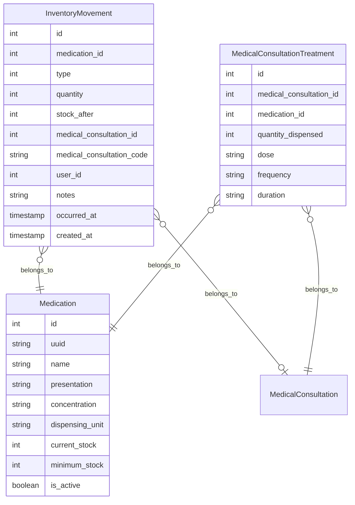

# Inventario de medicamentos

Este documento describe el módulo de inventario de medicamentos implementado en las etapas 06a (backend) y 06b (UI y
cierre de etapa): el catálogo de medicamentos, su libro de movimientos de solo inserción, la integración con el
tratamiento de una consulta médica, la búsqueda del catálogo y el reporte de proyección de demanda.

En resumen:

- Solo el personal autenticado usa este módulo. Todas las rutas están detrás del middleware `auth` más una
  comprobación `can:`.
- `medications.current_stock` nunca se escribe directamente desde un formulario ni desde un controlador de
  medicamentos: el único código autorizado para cambiarlo es `App\Services\Inventory\StockLedger`, y cada cambio
  queda registrado como una fila de `inventory_movements` en la misma transacción (ver
  [ADR-0007](../adr/0007-inventario-de-medicamentos-y-libro-de-movimientos.md)).
- El tratamiento de una consulta ya no es texto libre: cada línea referencia un medicamento del catálogo y descuenta
  su existencia a través de `App\Services\Inventory\TreatmentDispensation` (ver
  [consultas médicas](medical-consultations.md)).
- El catálogo se busca mediante Laravel Scout + Meilisearch, igual que los pacientes.
- El reporte de proyección de demanda es indicativo/demostrativo: ajusta una regresión lineal simple sobre el
  consumo mensual de un medicamento (ver [ADR-0008](../adr/0008-grafica-de-proyeccion-con-shadcn-vue-chart-y-unovis.md)).

Convenciones usadas en todo este documento:

- Los timestamps son `TIMESTAMP WITH TIME ZONE` y la zona horaria de la aplicación es `UTC` (`config/app.php`).
- Todas las columnas enteras con códigos de dominio están respaldadas por un backed enum de PHP (tipo de respaldo
  `int`); la base de datos impone el mismo dominio de valores de forma independiente mediante una restricción `CHECK`
  con nombre.

## Medication

Nombre de la tabla: `medications`

| columna         | tipo                     | restricciones                           | descripción                                                                       |
|-----------------|--------------------------|------------------------------------------|-----------------------------------------------------------------------------------|
| id              | SERIAL                   | PK                                       | Clave primaria sustituta del medicamento.                                         |
| uuid            | UUID                     | NOT NULL, UNIQUE                        | Identificador público (UUID v7, generado en el hook `creating` del modelo); se usa como clave de ruta. |
| name            | citext_255               | NOT NULL                                 | Nombre genérico del medicamento; comparación insensible a mayúsculas.             |
| presentation    | VARCHAR(64)              | NOT NULL                                 | Presentación (por ejemplo, "Tableta", "Jarabe").                                  |
| concentration   | VARCHAR(64)              | NOT NULL                                 | Concentración (por ejemplo, "500 mg").                                            |
| dispensing_unit | VARCHAR(32)              | NOT NULL                                 | Unidad de dispensación (por ejemplo, "tableta", "mL").                            |
| current_stock   | INTEGER                  | NOT NULL, DEFAULT 0, CHECK (current_stock >= 0) | Existencia actual. Solo `StockLedger` puede modificarla.                   |
| minimum_stock   | INTEGER                  | NOT NULL, DEFAULT 0, CHECK (minimum_stock >= 0) | Umbral de existencia baja.                                                 |
| is_active       | BOOLEAN                  | NOT NULL, DEFAULT true                   | Si el medicamento sigue disponible para nuevas dispensaciones.                    |
| created_at      | TIMESTAMP WITH TIME ZONE | NULLABLE                                 | Fecha y hora de creación.                                                         |
| updated_at      | TIMESTAMP WITH TIME ZONE | NULLABLE                                 | Fecha y hora de la última actualización.                                         |

- La combinación (name, presentation, concentration) es única (`medications_name_presentation_concentration_unique`).
- `is_low_stock` **no** es una columna: `Medication::isLowStock()` la calcula como `current_stock <= minimum_stock` y
  solo se persiste como atributo filtrable en el índice de Meilisearch (ver [Búsqueda](#búsqueda-de-medicamentos)),
  porque Meilisearch no puede comparar dos atributos del mismo documento entre sí dentro de un filtro.
- `can_be_deleted` tampoco es una columna: `MedicationController` la calcula por fila (`withExists`/`loadExists`)
  como `true` únicamente cuando el medicamento no tiene movimientos ni líneas de tratamiento (ver
  [Autorización](#autorización)).

## InventoryMovement

Nombre de la tabla: `inventory_movements`

| columna                  | tipo                     | restricciones                                | descripción                                                                          |
|--------------------------|--------------------------|-----------------------------------------------|----------------------------------------------------------------------------------------|
| id                       | SERIAL                   | PK                                            | Clave primaria sustituta del movimiento.                                              |
| medication_id            | INTEGER                  | NOT NULL, FK medications(id) RESTRICT         | Medicamento afectado; no se puede borrar un medicamento con movimientos.              |
| type                     | SMALLINT                 | NOT NULL, CHECK (type IN (1, 2, 3, 4))        | Tipo de movimiento (enum PHP `InventoryMovementType`).                                |
| quantity                 | INTEGER                  | NOT NULL, CHECK (quantity <> 0)               | Cantidad con signo aplicada al stock.                                                 |
| stock_after              | INTEGER                  | NOT NULL, CHECK (stock_after >= 0)            | Existencia resultante después de aplicar `quantity`.                                  |
| medical_consultation_id  | INTEGER                  | NULLABLE, FK medical_consultations(id) SET NULL | Consulta que originó una dispensación o reversión; `NULL` si la consulta se eliminó. |
| medical_consultation_code| VARCHAR(14)              | NULLABLE                                      | Copia del código de la consulta al momento del movimiento; sobrevive a su eliminación.|
| user_id                  | INTEGER                  | NOT NULL, FK users(id)                        | Usuario que registró el movimiento.                                                   |
| notes                    | VARCHAR(1024)            | NULLABLE                                      | Nota; obligatoria y no vacía cuando `type` es Ajuste.                                 |
| occurred_at              | TIMESTAMP WITH TIME ZONE | NOT NULL                                      | Fecha de consumo/registro (ver [Reglas del libro](#reglas-del-libro-de-movimientos)). |
| created_at               | TIMESTAMP WITH TIME ZONE | NOT NULL, DEFAULT now()                       | Fecha y hora en que se escribió la fila.                                              |

- No tiene `updated_at`: el modelo `InventoryMovement` fija `const UPDATED_AT = null` porque el libro es de solo
  inserción.
- Índices: (`medication_id`, `occurred_at`) para las consultas de proyección de demanda; `medical_consultation_id`
  para navegar del movimiento a su consulta.

## MedicalConsultationTreatment

Nombre de la tabla: `medical_consultation_treatments`

| columna                 | tipo                     | restricciones                                         | descripción                                                     |
|-------------------------|--------------------------|--------------------------------------------------------|-------------------------------------------------------------------|
| id                      | SERIAL                   | PK                                                     | Clave primaria sustituta de la línea de tratamiento.               |
| medical_consultation_id | INTEGER                  | NOT NULL, FK medical_consultations(id) CASCADE         | Consulta a la que pertenece esta línea.                            |
| medication_id           | INTEGER                  | NOT NULL, FK medications(id) RESTRICT                  | Medicamento dispensado; no se puede borrar un medicamento referenciado. |
| quantity_dispensed      | INTEGER                  | NOT NULL, CHECK (quantity_dispensed > 0)               | Cantidad dispensada de este medicamento en la consulta.            |
| dose                    | VARCHAR(255)             | NOT NULL                                               | Dosis prescrita (texto libre).                                     |
| frequency               | VARCHAR(255)             | NOT NULL                                               | Frecuencia prescrita (texto libre).                                |
| duration                | VARCHAR(255)             | NOT NULL                                               | Duración prescrita (texto libre).                                  |
| created_at              | TIMESTAMP WITH TIME ZONE | NULLABLE                                               | Fecha y hora de creación de la línea.                              |
| updated_at              | TIMESTAMP WITH TIME ZONE | NULLABLE                                               | Fecha y hora de la última actualización de la línea.               |

- La combinación (medical_consultation_id, medication_id) es única: una consulta no puede repetir el mismo
  medicamento en dos líneas.
- Esta tabla sustituye a la columna `treatment` (jsonb) que `medical_consultations` tenía hasta la etapa 04/05; ver
  [consultas médicas](medical-consultations.md).

## Enum InventoryMovementType

El backend solo envía valores enteros crudos; las etiquetas en español de la UI viven en
`resources/js/lib/inventoryLabels.ts`.

| Valor | Caso PHP             | Signo    | Etiqueta                    | Cuándo se usa                                                                 |
|-------|-----------------------|----------|-------------------------------|---------------------------------------------------------------------------------|
| 1     | Entry                 | positivo | "Entrada"                     | Alta de stock (compra, recepción).                                              |
| 2     | Dispensation          | negativo | "Dispensación"                | Se dispensa el medicamento como parte del tratamiento de una consulta.          |
| 3     | Adjustment            | ambos    | "Ajuste"                       | Corrección manual (merma, conteo físico); siempre exige una nota.               |
| 4     | DispensationReversal  | positivo | "Reversión de dispensación"   | Se edita o elimina una consulta y se restituye stock previamente dispensado.    |

## Restricciones únicas e índices con nombre

| Tabla                            | Nombre de la restricción                                            | Columnas                                    |
|-----------------------------------|-----------------------------------------------------------------------|-----------------------------------------------|
| medications                      | medications_uuid_unique                                              | UNIQUE (uuid)                                 |
| medications                      | medications_name_presentation_concentration_unique                   | UNIQUE (name, presentation, concentration)    |
| inventory_movements               | inventory_movements_medication_id_foreign                            | FK (medication_id) → medications(id), RESTRICT |
| inventory_movements               | inventory_movements_medical_consultation_id_foreign                  | FK (medical_consultation_id) → medical_consultations(id), SET NULL |
| inventory_movements               | inventory_movements_user_id_foreign                                  | FK (user_id) → users(id)                       |
| medical_consultation_treatments   | medical_consultation_treatments_medical_consultation_id_medicat*      | UNIQUE (medical_consultation_id, medication_id) |
| medical_consultation_treatments   | medical_consultation_treatments_medical_consultation_id_foreign      | FK (medical_consultation_id) → medical_consultations(id), CASCADE |
| medical_consultation_treatments   | medical_consultation_treatments_medication_id_foreign                | FK (medication_id) → medications(id), RESTRICT |

\* Nombre truncado por Postgres al límite de 63 caracteres de un identificador.

## Restricciones CHECK con nombre

| Tabla                          | Nombre de la restricción         | Regla                                                                 |
|----------------------------------|------------------------------------|--------------------------------------------------------------------------|
| medications                     | chk_current_stock_nonnegative      | `current_stock >= 0`                                                     |
| medications                     | chk_minimum_stock_nonnegative      | `minimum_stock >= 0`                                                     |
| inventory_movements              | chk_type_domain                    | `type IN (1, 2, 3, 4)`                                                   |
| inventory_movements              | chk_quantity_nonzero                | `quantity <> 0`                                                          |
| inventory_movements              | chk_quantity_sign_by_type           | `(type=1 AND quantity>0) OR (type=2 AND quantity<0) OR (type=3) OR (type=4 AND quantity>0)` |
| inventory_movements              | chk_stock_after_nonnegative          | `stock_after >= 0`                                                       |
| inventory_movements              | chk_consultation_code_by_type       | `(type IN (2, 4)) = (medical_consultation_code IS NOT NULL)`             |
| inventory_movements              | chk_consultation_id_by_type         | `type IN (2, 4) OR medical_consultation_id IS NULL`                      |
| inventory_movements              | chk_adjustment_notes                 | `type <> 3 OR btrim(coalesce(notes, '')) <> ''`                          |
| medical_consultation_treatments  | chk_quantity_dispensed_positive     | `quantity_dispensed > 0`                                                 |

## Reglas del libro de movimientos

`App\Services\Inventory\StockLedger` es el único código autorizado para cambiar `medications.current_stock`. Sus
reglas, detalladas en [ADR-0007](../adr/0007-inventario-de-medicamentos-y-libro-de-movimientos.md):

| Regla                    | Detalle                                                                                                                                                                |
|----------------------------|--------------------------------------------------------------------------------------------------------------------------------------------------------------------------|
| Único camino               | Todo cambio de `current_stock` pasa por `StockLedger::record()`; escribirlo por otro código rompería la consistencia del libro.                                        |
| Transacción                | `record()` lanza `LogicException` si se invoca fuera de una transacción abierta (`DB::transactionLevel() === 0`).                                                       |
| Bloqueo por fila            | `StockLedger::lock()` bloquea los medicamentos afectados con `SELECT ... FOR UPDATE`, ordenados ascendentemente por `id`, para que dos operaciones concurrentes sobre los mismos medicamentos no puedan interbloquearse ni sobregirar el stock. |
| Stock no negativo           | Si `current_stock + quantity` resultaría negativo, `record()` lanza `InsufficientStockException` en lugar de escribir el movimiento.                                    |
| Solo inserción              | `InventoryMovement` fija `const UPDATED_AT = null` y sus hooks `updating`/`deleting` lanzan `LogicException`: un movimiento nunca se edita ni se borra; las correcciones se registran como movimientos nuevos. |
| Copia del código de consulta | Las dispensaciones y reversiones guardan `medical_consultation_id` y una copia de `medical_consultation_code`. Al eliminar la consulta, la referencia pasa a `NULL` (`ON DELETE SET NULL`), pero la copia del código se conserva. |
| Fecha de consumo (`occurred_at`) | Dispensaciones y reversiones usan la fecha de creación de la consulta (para atribuir el consumo al acto clínico); entradas y ajustes usan el momento en que se registran. |

## Integración con consultas

`App\Services\Inventory\TreatmentDispensation::sync()` reconcilia las líneas de tratamiento enviadas al crear o
editar una consulta contra sus líneas existentes, dentro de la misma transacción del agregado:

- Calcula la diferencia (delta) de `quantity_dispensed` por medicamento entre lo enviado y lo existente.
- Un delta positivo registra un movimiento `Dispensation`; un delta negativo registra un movimiento
  `DispensationReversal` por la cantidad restituida.
- Un medicamento que ya no aparece en las líneas enviadas se elimina de `medical_consultation_treatments` y su
  cantidad completa se restituye como `DispensationReversal`.
- Eliminar una consulta llama a `TreatmentDispensation::restoreAll()`, que sincroniza contra una lista vacía de
  líneas: restituye todo el stock dispensado antes de que la consulta se borre.
- Si algún delta positivo excede la existencia disponible del medicamento, se lanza `InsufficientStockException`,
  que `StoreMedicalConsultationRequest`/`UpdateMedicalConsultationRequest` traducen en un error 422 por línea, con
  clave `treatment.N.quantity_dispensed` (`N` es el índice base cero de la línea).
- Un medicamento solo puede aparecer una vez por consulta (`distinct` en `treatment.*.medication_uuid`, respaldado
  por la restricción única de la tabla).
- Al crear una consulta, `treatment.*.medication_uuid` solo acepta medicamentos activos. Al editar, también acepta
  un medicamento inactivo si ya está vinculado a esa consulta, para que una línea prescrita antes de desactivarse
  el medicamento siga siendo editable (por ejemplo, para ajustar su cantidad) sin quedar bloqueada.

## Búsqueda de medicamentos

El catálogo de medicamentos se busca con Laravel Scout + Meilisearch, siguiendo el mismo patrón que
[ADR-0006](../adr/0006-busqueda-de-pacientes-con-scout-y-meilisearch.md) usó para pacientes (registrado como un
punto adicional en [ADR-0007](../adr/0007-inventario-de-medicamentos-y-libro-de-movimientos.md)):

| Tema             | Comportamiento                                                                                                                  |
|--------------------|-------------------------------------------------------------------------------------------------------------------------------------|
| Campos indexados    | `Medication::toSearchableArray()` envía `id`, `name`, `presentation`, `concentration`, `is_active` e `is_low_stock` (calculado). |
| Atributos de búsqueda | `name`, `presentation`, `concentration` (`config/scout.php`).                                                                 |
| Atributos filtrables | `is_active`, `is_low_stock` — este último calculado porque Meilisearch no puede comparar dos atributos entre sí en un filtro. |
| Sin término de búsqueda | `MedicationController::index()` consulta Postgres directamente, aplicando el filtro de stock bajo con `whereColumn`.        |
| Con término de búsqueda | Usa `Medication::search($query)`, aplicando el mismo filtro de stock bajo como filtro Scout (`is_low_stock`).               |
| Reindexación         | Cada cambio de stock reindexa el medicamento después del commit (`after_commit`), igual que con `Patient`.                    |
| Datos de demostración | La siembra desactiva la sincronización durante la carga masiva (`Medication::withoutSyncingToSearch`) y ejecuta `scout:import "App\Models\Medication"` al final. |

## Proyección de demanda

`App\Services\Inventory\MedicationDemandProjection` calcula, para un medicamento, un ajuste lineal simple
(mínimos cuadrados ordinarios, OLS) sobre su consumo mensual histórico. Es de solo lectura: nunca escribe en el
libro de movimientos. El reporte es indicativo/demostrativo, no una garantía de compra (ver
[ADR-0008](../adr/0008-grafica-de-proyeccion-con-shadcn-vue-chart-y-unovis.md)).

### Serie de consumo

- El consumo mensual se agrega en `America/Mexico_City` a partir de los movimientos `Dispensation` y
  `DispensationReversal`: `consumo = -SUM(quantity)` agrupado por mes (`date_trunc('month', occurred_at AT TIME
  ZONE 'America/Mexico_City')`), de modo que dispensaciones (negativas) y reversiones (positivas) se compensan.
- La serie se rellena con ceros entre el primer mes con consumo y el último mes calendario completo antes de
  `now()`: un mes sin consumo aporta un punto en 0 en lugar de quedar ausente de la serie.
- El mes en curso siempre se excluye, por estar incompleto.

### Ajuste OLS

Con `x = 0..n-1` (un punto por mes calendario) y `y` = consumo del mes:

- Pendiente: `b = Sxy / Sxx`
- Intercepto: `a = ȳ - b·x̄`
- Coeficiente de determinación: `R² = 1 - SSres / SStot`
- `R² = 1.0` cuando `SStot = 0` (una serie constante es un ajuste perfecto).
- `b = 0` cuando `Sxx = 0` (menos de dos valores `x` distintos).

### Casos límite y horizonte

| Caso                          | Comportamiento                                                                                          |
|---------------------------------|--------------------------------------------------------------------------------------------------------|
| Menos de 2 meses completos       | `status = 'insufficient_data'`; `fitted`, `projection` y los campos numéricos derivados quedan vacíos/`null`. |
| Horizonte                       | Fijo en 3 meses; el reporte no ofrece selector de horizonte.                                            |
| Valores proyectados negativos    | Se recortan a 0 (`max(0.0, …)`); la línea ajustada sobre meses históricos no se recorta.                |
| Demanda del próximo mes          | `next_month_demand = ceil(proyección del primer mes del horizonte)`.                                    |
| Reorden sugerido                 | `suggested_reorder_quantity = max(0, next_month_demand - current_stock)`; cantidad indicativa, no una orden de compra. |

### Limitaciones y extensión futura

- No modela estacionalidad ni ciclos: es una regresión lineal simple sobre toda la serie.
- No valida outliers ni eventos atípicos (por ejemplo, una compra excepcional) antes de ajustar la recta.
- Solo usa el consumo histórico del propio medicamento como variable; no incorpora variables externas (estación
  del año, campañas, disponibilidad de proveedores).
- Extender este servicio con estacionalidad, validación de datos atípicos o variables adicionales no requiere
  cambiar su contrato público (`forMedication()`/`fromSeries()` devuelven siempre un `DemandProjectionResult`).

## Autorización

El módulo usa cuatro permisos de inventario más uno de reportes, de `App\Enums\Permission`:

| Permiso            | Otorga                                                                                                         |
|-----------------------|---------------------------------------------------------------------------------------------------------------|
| `inventory.view`      | Consultar el catálogo, el detalle de un medicamento y su historial de movimientos; ver la entrada "Inventario" de la barra lateral. |
| `inventory.create`    | Dar de alta medicamentos y registrar entradas de stock.                                                        |
| `inventory.update`    | Editar un medicamento, activarlo/desactivarlo y registrar ajustes de stock.                                    |
| `inventory.delete`    | Eliminar un medicamento — solo mientras `can_be_deleted` sea verdadero (sin movimientos ni líneas de tratamiento). |
| `reports.generate`    | Ver el reporte de proyección de demanda; gatea la entrada "Reportes y estadísticas" de la barra lateral y la ruta `reports.medication-demand`. |

- Un ajuste (`Adjustment`) siempre exige una nota que explique el motivo (`chk_adjustment_notes` y
  `RecordAdjustmentRequest::validateNotesNotBlank()`).
- `MedicationController::destroy()` devuelve un error 422 (`ValidationException`, clave `medication`) cuando el
  medicamento tiene movimientos o líneas de tratamiento; las claves foráneas `RESTRICT` de ambas tablas respaldan
  esta regla también a nivel de base de datos.
- El único rol sembrado sigue siendo `super-admin`, con acceso total mediante `Gate::before()` (ver
  [ADR-0005](../adr/0005-permission-taxonomy-and-role-catalog.md)).

## Rutas y páginas

Todas las rutas requieren `auth`; la autorización la aplica el middleware `can:` de cada ruta.

| Método | URI                                                    | Nombre                        | Autorización                  | Respuesta                                    |
|--------|----------------------------------------------------------|----------------------------------|----------------------------------|------------------------------------------------|
| GET    | `/inventory`                                              | `inventory.index`                | `viewAny,App\Models\Medication`  | Inertia `inventory/Index`                      |
| POST   | `/inventory/medications`                                  | `inventory.store`                | `create,App\Models\Medication`   | Redirect a `inventory.index` con flash          |
| GET    | `/inventory/medications/{medication}`                     | `inventory.show`                 | `view,medication`                | Inertia `inventory/Show`                       |
| PATCH  | `/inventory/medications/{medication}`                     | `inventory.update`               | `update,medication`              | Redirect (back) con flash                       |
| PATCH  | `/inventory/medications/{medication}/activate`            | `inventory.activate`             | `update,medication`              | Redirect (back) con flash                       |
| PATCH  | `/inventory/medications/{medication}/deactivate`          | `inventory.deactivate`           | `update,medication`              | Redirect (back) con flash                       |
| DELETE | `/inventory/medications/{medication}`                     | `inventory.destroy`              | `delete,medication`              | Redirect a `inventory.index` con flash          |
| POST   | `/inventory/medications/{medication}/entries`             | `inventory.entries.store`        | `recordEntry,medication`         | Redirect (back) con flash                       |
| POST   | `/inventory/medications/{medication}/adjustments`         | `inventory.adjustments.store`    | `recordAdjustment,medication`    | Redirect (back) con flash                       |
| GET    | `/reports/medication-demand`                              | `reports.medication-demand`      | `reports.generate`               | Inertia `reports/MedicationDemand`              |

`{medication}` se resuelve por `uuid`, nunca por el id numérico.

### Flujo de la interfaz

1. **Listado** (`inventory/Index.vue`): tabla paginada y buscable (nombre, presentación, concentración) con filtro
   de existencia baja; cada fila muestra una insignia de existencia baja cuando aplica y una insignia "Inactivo"
   cuando el medicamento está desactivado. Las acciones (Editar, Activar/Desactivar, Eliminar) se muestran según
   los permisos y, para Eliminar, según `can_be_deleted`; "Nuevo medicamento" requiere `inventory.create`.
2. **Alta y edición**: `MedicationFormDialog` (mismo diálogo para ambos modos) valida en el servidor; `is_active`
   siempre se envía explícitamente.
3. **Activar/desactivar/eliminar**: `MedicationActionDialog` pide confirmación antes de desactivar o eliminar;
   activar no requiere confirmación. Un intento de eliminar un medicamento con historial deja el diálogo abierto y
   muestra el error 422 del servidor.
4. **Detalle** (`inventory/Show.vue`): datos del medicamento, las mismas acciones de cabecera que el listado, más
   "Registrar entrada" (`inventory.create`) y "Registrar ajuste" (`inventory.update`), y la tabla de historial de
   movimientos.
5. **Entrada y ajuste**: `StockEntryDialog` exige una cantidad positiva; `StockAdjustmentDialog` pide una dirección
   (Aumentar/Disminuir) y una magnitud positiva, que el formulario transforma en una cantidad con signo antes de
   enviarla, además de una nota obligatoria.
6. **Historial de movimientos** (`MovementHistoryTable`): fecha, tipo (insignia con la etiqueta de
   `InventoryMovementType`), cantidad con signo, existencia resultante, código de consulta (o "—"), usuario y
   notas; paginado.
7. **Reporte de proyección** (`reports/MedicationDemand.vue`): un selector de medicamento (`ComboboxField`) actualiza
   la URL con `?medication=`; sin selección, muestra una invitación a elegir un medicamento; con datos insuficientes,
   un estado vacío explícito; en el caso normal, cuatro tarjetas (demanda proyectada del próximo mes, existencia
   actual, reorden sugerido, R²), una nota de tendencia y la gráfica de tres series.

## Datos de desarrollo

```bash
make seed-demo
```

Ejecuta `php artisan demo:seed`, que además de usuarios, pacientes y consultas siembra:

- 39 medicamentos (`database/seeders/Demo/DemoMedicationSeeder`, catálogo `demo/medications.json`), cada uno con su
  stock inicial registrado como movimiento `Entry`.
- 12 meses de historial (`DemoConsultationSeeder::LOOKBACK_DAYS`, ~365 días tratados como 12 meses iguales),
  con reabastecimiento mensual y ajustes trimestrales (3 medicamentos muestreados por trimestre, cada uno con una
  merma de 1 a 3 unidades y una nota en español).
- 600 consultas por defecto (`--consultations=600`), cuyas líneas de tratamiento dispensan stock real a través de
  `TreatmentDispensation`; algunos casos clínicos llevan un factor `demand_growth` que produce una tendencia de
  consumo creciente visible en la proyección.
- Al finalizar, `scout:sync-index-settings` y `scout:import "App\Models\Medication"` (además del de `Patient`), ya
  que la siembra desactiva la sincronización automática mientras carga los datos.

## Fuera de alcance

- **Lotes, caducidades y proveedores** no se modelan en esta etapa; quedan como extensión futura (ver
  [ADR-0007](../adr/0007-inventario-de-medicamentos-y-libro-de-movimientos.md)).
- **Órdenes de compra**: el reorden sugerido del reporte de proyección es solo una cifra indicativa, no genera ni
  registra ninguna orden.
- **Reportes en PDF o Excel** no existen en este módulo; el reporte de proyección solo se consulta en pantalla.
- **Selector de horizonte**: el reporte de proyección de demanda usa siempre un horizonte fijo de 3 meses.

## Diagrama entidad-relación


