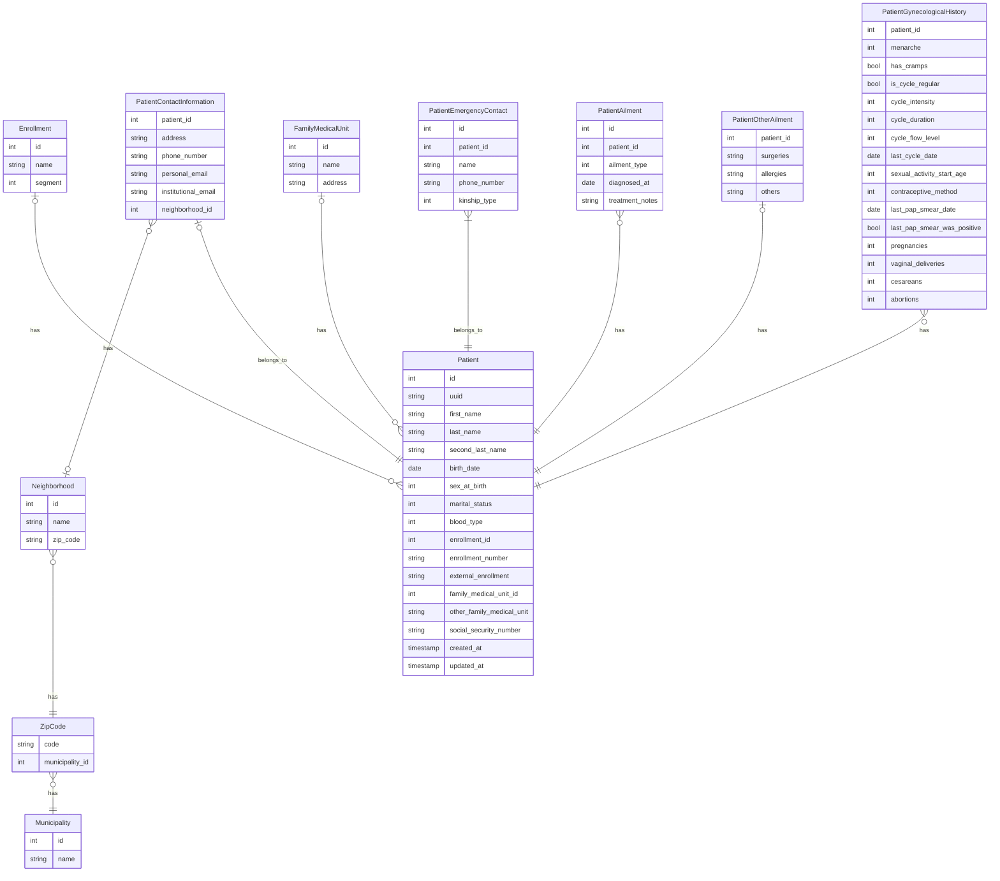

# Patient Data Model

This document describes the patient data model implemented by stage 03 of patient registration: the catalog
tables it depends on, the `patients` table, and the five one-to-one/one-to-many extension tables that hold a
patient's contact, emergency-contact, ailment, and gynecological-history data.

Conventions used throughout this document:

- Phone numbers are stored in E.164 format (leading `+`, country code, digits only, no spaces or extensions).
- Citext-backed text columns (`municipalities.name`, `neighborhoods.name`, `family_medical_units.name`,
  `enrollments.name`, `patient_contact_information.personal_email`, `patient_contact_information.institutional_email`)
  are compared case-insensitively and length-bounded to 255 characters.
- `patients.uuid` is generated by the application as a UUID v7, so external references order by creation time.
- All domain-coded integer columns are backed by a PHP backed enum (`int` backing type); the database enforces the
  same value domain independently via a `CHECK` constraint, so the constraint and the enum can never drift apart.

## Municipality

Table name: `municipalities`

| column | type        | constraints      | description                                 |
|--------|-------------|------------------|----------------------------------------------|
| id     | SMALLSERIAL | PK               | Surrogate primary key for the municipality. |
| name   | citext_255  | NOT NULL, UNIQUE | Name of the municipality.                   |

## ZipCode

Table name: `zip_codes`

| column          | type       | constraints                     | description                                   |
|-----------------|------------|----------------------------------|-----------------------------------------------|
| code            | VARCHAR(5) | PK, CHECK (code ~ '^[0-9]{5}$') | Postal code identifier.                       |
| municipality_id | SMALLINT   | NOT NULL, FK municipalities(id) | Municipality associated with the postal code. |

## Neighborhood

Table name: `neighborhoods`

| column   | type       | constraints                          | description                                    |
|----------|------------|---------------------------------------|-------------------------------------------------|
| id       | SERIAL     | PK                                     | Surrogate primary key for the neighborhood.     |
| name     | citext_255 | NOT NULL                              | Name of the neighborhood.                       |
| zip_code | VARCHAR(5) | NOT NULL, FK zip_codes(code), INDEX   | Postal code associated with the neighborhood.   |

- Unique constraint on (name, zip_code) so neighborhood names are unique within one postal code.

## FamilyMedicalUnit

Table name: `family_medical_units`

| column  | type         | constraints      | description                                        |
|---------|--------------|------------------|------------------------------------------------------|
| id      | SERIAL       | PK               | Surrogate primary key for the family medical unit. |
| name    | citext_255   | NOT NULL, UNIQUE | Name of the family medical unit.                   |
| address | VARCHAR(255) | NOT NULL         | Physical address of the medical unit.              |

## Enrollment

Table name: `enrollments`

| column  | type       | constraints                              | description                                                                |
|---------|------------|--------------------------------------------|------------------------------------------------------------------------------|
| id      | SERIAL     | PK                                        | Surrogate primary key for the enrollment catalog entry.                    |
| name    | citext_255 | NOT NULL                                  | Enrollment program name.                                                    |
| segment | SMALLINT   | NOT NULL, CHECK (segment IN (1,2,3,4))    | Encoded segment for the enrollment (PHP enum `EnrollmentSegment`).          |

- Unique constraint on (name, segment) so enrollment names are unique within each segment.

- `EnrollmentSegment` PHP enum, `segment` values:
    - 1: Student
    - 2: Academic
    - 3: Administrative
    - 4: Operational

## Patient

Table name: `patients`

| column                    | type                     | constraints                                                       | description                                                  |
|---------------------------|--------------------------|---------------------------------------------------------------------|----------------------------------------------------------------|
| id                        | SERIAL                   | PK                                                                 | Surrogate primary key for the patient.                       |
| uuid                      | UUID                     | NOT NULL, UNIQUE                                                   | External UUID for external references (UUID v7).             |
| first_name                | VARCHAR(255)             | NOT NULL                                                           | Patient's first name.                                        |
| last_name                 | VARCHAR(255)             | NOT NULL                                                           | Patient's paternal last name.                                |
| second_last_name          | VARCHAR(255)             | NULLABLE                                                           | Patient's maternal last name.                                |
| birth_date                | DATE                     | NOT NULL                                                           | Date of birth.                                               |
| sex_at_birth              | SMALLINT                 | NOT NULL, CHECK (sex_at_birth IN (1, 2))                           | Encoded sex at birth (PHP enum `SexAtBirth`).                |
| marital_status            | SMALLINT                 | NOT NULL, CHECK (marital_status IN (1,2,3,4))                      | Encoded marital status (PHP enum `MaritalStatus`).           |
| blood_type                | SMALLINT                 | NOT NULL, CHECK (blood_type IN (1, 2, 3, 4, 5, 6, 7, 8))           | Encoded blood type (PHP enum `BloodType`).                   |
| enrollment_id             | INTEGER                  | NULLABLE, FK enrollments(id)                                       | Enrollment program linked to the patient.                    |
| enrollment_number         | VARCHAR(255)             | NULLABLE                                                           | Enrollment number within the program.                        |
| external_enrollment       | VARCHAR(255)             | NULLABLE                                                           | External-system enrollment identifier.                       |
| family_medical_unit_id    | INTEGER                  | NULLABLE, FK family_medical_units(id)                              | Assigned family medical unit.                                |
| other_family_medical_unit | VARCHAR(255)             | NULLABLE                                                           | Family medical unit description when not in the catalog.     |
| social_security_number    | VARCHAR(11)              | NOT NULL, UNIQUE, CHECK (social_security_number ~ '^[0-9]{11}$')   | Patient's social security number.                            |
| created_at                | TIMESTAMP WITH TIME ZONE | NOT NULL                                                           | Timestamp when the patient record was created.               |
| updated_at                | TIMESTAMP WITH TIME ZONE | NOT NULL                                                           | Timestamp of the last patient record update.                 |

- Unique constraint on (enrollment_id, enrollment_number) so enrollment numbers are unique within one program.
- Check constraint on enrollment enforces a strict either/or:
    - enrollment_id NULL AND enrollment_number NULL -> external_enrollment NOT NULL
    - enrollment_id NOT NULL AND enrollment_number NOT NULL -> external_enrollment NULL
- Check constraint on family medical unit enforces a strict either/or: if family_medical_unit_id is not null then
  other_family_medical_unit must be null, and vice versa.
    - family_medical_unit_id NULL -> other_family_medical_unit NOT NULL
    - family_medical_unit_id NOT NULL -> other_family_medical_unit NULL

- `SexAtBirth` PHP enum, `sex_at_birth` values:
    - 1: Male
    - 2: Female

- `MaritalStatus` PHP enum, `marital_status` values:
    - 1: Single
    - 2: Married
    - 3: Divorced
    - 4: Widowed

- `BloodType` PHP enum, `blood_type` values:
    - 1: A+
    - 2: A-
    - 3: B+
    - 4: B-
    - 5: AB+
    - 6: AB-
    - 7: O+
    - 8: O-

## PatientContactInformation

Table name: `patient_contact_information`

| column              | type         | constraints                                               | description                                    |
|---------------------|--------------|-------------------------------------------------------------|---------------------------------------------------|
| patient_id          | INTEGER      | PK, FK patients(id)                                        | Patient this contact information belongs to.   |
| address             | VARCHAR(255) | NOT NULL                                                   | Patient's residential address.                 |
| phone_number        | VARCHAR(16)  | NOT NULL, CHECK (phone_number ~ '^\+[1-9]\d{1,14}$')       | Patient's primary phone number.                |
| personal_email      | citext_255   | NOT NULL                                                   | Patient's personal email address.              |
| institutional_email | citext_255   | NULLABLE, UNIQUE (WHERE institutional_email IS NOT NULL)   | Patient's institutional email address.         |
| neighborhood_id     | INTEGER      | NULLABLE, FK neighborhoods(id)                             | Neighborhood of the patient's residence.       |

- One record per patient: `patient_id` is the primary key, preventing more than one contact-information row.
- Partial unique index on institutional_email, only enforced when the value is not null, so more than one patient
  may leave it empty.

## PatientEmergencyContact

Table name: `patient_emergency_contacts`

| column       | type         | constraints                                            | description                                              |
|--------------|--------------|-----------------------------------------------------------|-------------------------------------------------------------|
| id           | SERIAL       | PK                                                       | Surrogate primary key for the emergency contact record.  |
| patient_id   | INTEGER      | NOT NULL, FK patients(id), INDEX                         | Patient associated with this emergency contact.          |
| name         | VARCHAR(255) | NOT NULL                                                 | Emergency contact's full name.                           |
| phone_number | VARCHAR(16)  | NOT NULL, CHECK (phone_number ~ '^\+[1-9]\d{1,14}$')     | Emergency contact's phone number.                        |
| kinship_type | SMALLINT     | NOT NULL, CHECK (kinship_type IN (1,2,3,4,5,6))          | Encoded kinship to the patient (PHP enum `KinshipType`). |

- Unique constraint on (patient_id, phone_number) so one patient cannot register the same contact number twice.

- `KinshipType` PHP enum, `kinship_type` values:
    - 1: Parent
    - 2: Sibling
    - 3: Spouse
    - 4: Child
    - 5: Friend
    - 6: Other

## PatientAilment

Table name: `patient_ailments`

| column          | type     | constraints                                       | description                                    |
|-----------------|----------|------------------------------------------------------|---------------------------------------------------|
| id              | SERIAL   | PK                                                  | Surrogate primary key for the ailment record.   |
| patient_id      | INTEGER  | NOT NULL, FK patients(id), INDEX                    | Patient experiencing the ailment.               |
| ailment_type    | SMALLINT | NOT NULL, CHECK (ailment_type IN (1,2,3,4,5,6))     | Encoded ailment type (PHP enum `AilmentType`).  |
| diagnosed_at    | DATE     | NOT NULL                                            | Date when the ailment was diagnosed.            |
| treatment_notes | TEXT     | NULLABLE                                            | Notes regarding the treatment plan.             |

- Unique constraint on (patient_id, ailment_type) so a patient cannot have duplicate rows for the same ailment type.

- `AilmentType` PHP enum, `ailment_type` values:
    - 1: Diabetes
    - 2: Hypertension
    - 3: Epilepsy
    - 4: Pneumopathies
    - 5: Cardiopathies
    - 6: Cancer

## PatientOtherAilment

Table name: `patient_other_ailments`

| column     | type    | constraints         | description                                          |
|------------|---------|------------------------|---------------------------------------------------------|
| patient_id | INTEGER | PK, FK patients(id)   | Patient this additional-ailments record belongs to.  |
| surgeries  | TEXT    | NULLABLE              | Notes on past surgeries.                              |
| allergies  | TEXT    | NULLABLE              | Recorded allergies.                                   |
| others     | TEXT    | NULLABLE              | Miscellaneous ailment information.                    |

- Check constraint requires at least one of surgeries, allergies, or others to be not null; an entirely-empty row
  is rejected because the row itself would carry no information.

## PatientGynecologicalHistory

Table name: `patient_gynecological_history`

| column                      | type     | constraints                                                            | description                                                          |
|------------------------------|----------|---------------------------------------------------------------------------|--------------------------------------------------------------------------|
| patient_id                  | INTEGER  | PK, FK patients(id)                                                     | Patient this gynecological history belongs to.                      |
| menarche                    | SMALLINT | NOT NULL, CHECK (menarche > 0)                                          | Age at first menstruation.                                           |
| has_cramps                  | BOOLEAN  | NOT NULL                                                                | Indicates presence of menstrual cramps.                              |
| is_cycle_regular            | BOOLEAN  | NOT NULL                                                                | Indicates whether the menstrual cycle is regular.                    |
| cycle_intensity             | SMALLINT | NOT NULL, CHECK (cycle_intensity BETWEEN 1 AND 10)                      | Encoded intensity of the menstrual cycle (1-10 scale).               |
| cycle_duration              | SMALLINT | NOT NULL, CHECK (cycle_duration > 0)                                    | Average duration of the menstrual cycle, in days.                    |
| cycle_flow_level            | SMALLINT | NOT NULL, CHECK (cycle_flow_level > 0)                                  | Average flow level during the menstrual cycle.                       |
| last_cycle_date             | DATE     | NOT NULL                                                                | Date of the last menstrual cycle.                                    |
| sexual_activity_start_age   | SMALLINT | NULLABLE                                                                | Age at onset of sexual activity.                                     |
| contraceptive_method        | SMALLINT | NULLABLE, CHECK (contraceptive_method IN (1,2,3,4,5,6,7,8,9,10,11))     | Encoded contraceptive method in use (PHP enum `ContraceptiveMethod`).|
| last_pap_smear_date         | DATE     | NULLABLE                                                                | Date of the last pap smear.                                          |
| last_pap_smear_was_positive | BOOLEAN  | NULLABLE                                                                | Indicates whether the last pap smear was positive.                   |
| pregnancies                 | SMALLINT | NOT NULL, CHECK (pregnancies >= 0)                                      | Total number of pregnancies.                                         |
| vaginal_deliveries          | SMALLINT | NOT NULL, CHECK (vaginal_deliveries >= 0)                               | Total number of vaginal deliveries.                                  |
| cesareans                   | SMALLINT | NOT NULL, CHECK (cesareans >= 0)                                        | Total number of cesarean sections.                                   |
| abortions                   | SMALLINT | NOT NULL, CHECK (abortions >= 0)                                        | Total number of abortions.                                           |

- Check constraint keeps delivery counts consistent with reported pregnancies:
  `vaginal_deliveries + cesareans + abortions <= pregnancies`.
- Check constraint on the pap-smear pair enforces a strict either/or: if last_pap_smear_date is not null then
  last_pap_smear_was_positive must also be not null, and vice versa.

- `ContraceptiveMethod` PHP enum, `contraceptive_method` values:
    - 1: Condom
    - 2: Oral Pills
    - 3: IUD
    - 4: Implant
    - 5: Injection
    - 6: Patch
    - 7: Ring
    - 8: Barrier Methods
    - 9: Sterilization
    - 10: Other
    - 11: None

## Named Unique and Index Constraints

| Table                          | Constraint name                                              | Columns                          |
|---------------------------------|---------------------------------------------------------------|-------------------------------------|
| municipalities                  | municipalities_name_unique                                    | UNIQUE (name)                       |
| zip_codes                       | zip_codes_municipality_id_foreign                              | FK (municipality_id)                |
| neighborhoods                   | neighborhoods_zip_code_index                                   | INDEX (zip_code)                    |
| neighborhoods                   | neighborhoods_name_zip_code_unique                              | UNIQUE (name, zip_code)             |
| family_medical_units             | family_medical_units_name_unique                                | UNIQUE (name)                       |
| enrollments                     | enrollments_name_segment_unique                                 | UNIQUE (name, segment)              |
| patients                        | patients_uuid_unique                                            | UNIQUE (uuid)                       |
| patients                        | patients_social_security_number_unique                          | UNIQUE (social_security_number)     |
| patients                        | patients_enrollment_id_enrollment_number_unique                 | UNIQUE (enrollment_id, enrollment_number) |
| patient_contact_information      | patient_contact_information_institutional_email_unique          | UNIQUE INDEX (institutional_email) WHERE NOT NULL |
| patient_emergency_contacts       | patient_emergency_contacts_patient_id_index                     | INDEX (patient_id)                  |
| patient_emergency_contacts       | patient_emergency_contacts_patient_id_phone_number_unique        | UNIQUE (patient_id, phone_number)   |
| patient_ailments                 | patient_ailments_patient_id_index                                | INDEX (patient_id)                  |
| patient_ailments                 | patient_ailments_patient_id_ailment_type_unique                  | UNIQUE (patient_id, ailment_type)   |

## Named Check Constraints

| Table                          | Constraint name                       | Rule                                                                                     |
|----------------------------------|------------------------------------------|---------------------------------------------------------------------------------------------|
| zip_codes                        | chk_zip_code_format                    | `code ~ '^[0-9]{5}$'`                                                                    |
| enrollments                      | chk_enrollment_segment                 | `segment IN (1, 2, 3, 4)`                                                                |
| patients                         | chk_sex_at_birth_domain                | `sex_at_birth IN (1, 2)`                                                                 |
| patients                         | chk_marital_status_domain              | `marital_status IN (1, 2, 3, 4)`                                                         |
| patients                         | chk_blood_type_domain                  | `blood_type IN (1, 2, 3, 4, 5, 6, 7, 8)`                                                 |
| patients                         | chk_social_security_number_format      | `social_security_number ~ '^[0-9]{11}$'`                                                 |
| patients                         | chk_enrollment_consistency             | Strict either/or between (enrollment_id, enrollment_number) and external_enrollment.     |
| patients                         | chk_family_medical_unit_consistency    | Strict either/or between family_medical_unit_id and other_family_medical_unit, and vice versa. |
| patient_contact_information       | chk_phone_number_format                | `phone_number ~ '^\+[1-9]\d{1,14}$'`                                                     |
| patient_emergency_contacts        | chk_phone_number_format                | `phone_number ~ '^\+[1-9]\d{1,14}$'`                                                     |
| patient_emergency_contacts        | chk_kinship_type_domain                | `kinship_type IN (1, 2, 3, 4, 5, 6)`                                                     |
| patient_ailments                  | chk_ailment_type_domain                | `ailment_type IN (1, 2, 3, 4, 5, 6)`                                                     |
| patient_other_ailments             | chk_other_ailments_nonempty            | At least one of surgeries, allergies, others is not null.                               |
| patient_gynecological_history      | chk_menarche_positive                  | `menarche > 0`                                                                           |
| patient_gynecological_history      | chk_cycle_intensity_domain             | `cycle_intensity BETWEEN 1 AND 10`                                                       |
| patient_gynecological_history      | chk_cycle_duration_positive            | `cycle_duration > 0`                                                                     |
| patient_gynecological_history      | chk_cycle_flow_level_positive          | `cycle_flow_level > 0`                                                                   |
| patient_gynecological_history      | chk_contraceptive_method_domain        | `contraceptive_method IN (1, 2, 3, 4, 5, 6, 7, 8, 9, 10, 11)`                            |
| patient_gynecological_history      | chk_pregnancies_nonnegative            | `pregnancies >= 0`                                                                       |
| patient_gynecological_history      | chk_vaginal_deliveries_nonnegative     | `vaginal_deliveries >= 0`                                                                |
| patient_gynecological_history      | chk_cesareans_nonnegative              | `cesareans >= 0`                                                                         |
| patient_gynecological_history      | chk_abortions_nonnegative              | `abortions >= 0`                                                                         |
| patient_gynecological_history      | chk_last_pap_smear_consistency         | Strict either/or between last_pap_smear_date and last_pap_smear_was_positive, and vice versa. |
| patient_gynecological_history      | chk_counts_consistent                  | `vaginal_deliveries + cesareans + abortions <= pregnancies`                              |

## Entity-Relationship Diagram

